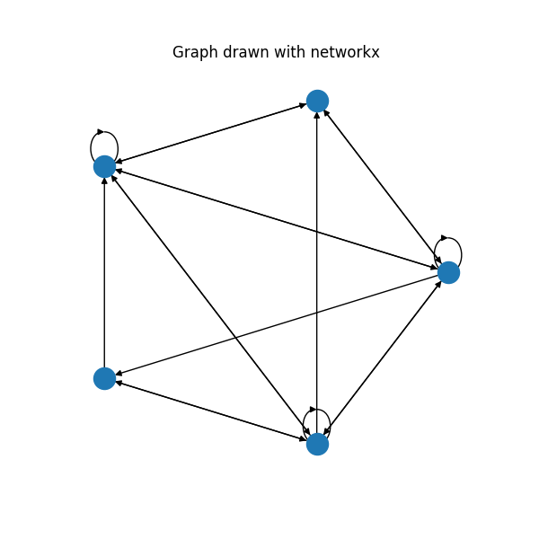
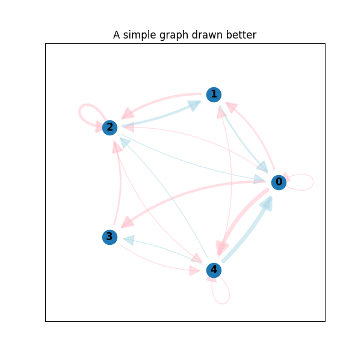
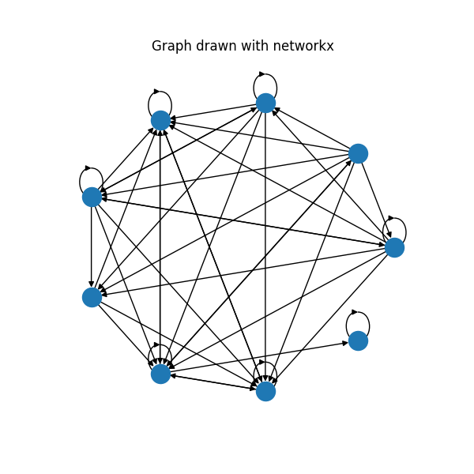
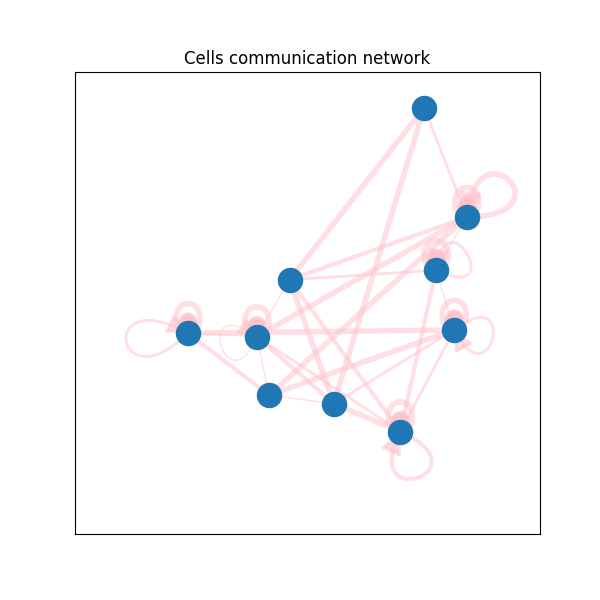

# networkx drawing self-loops
By default, networkx has problems with drawing self-loops in graphs. It makes it hard to draw a graph with self-loops or to make a nicely looking chord diagram. This repository provides some code to draw self-loops nicely

# Examples

Let's have a look on how networkx draws graphs with self-loops

```python
import matplotlib.pyplot as plt
import networkx as nx
import numpy as np 

from drawing import chord_diagram  # Code from this repo

# Create graph with some weights
graph = nx.DiGraph(
    np.array([
        [1, 2, 1, 3, 5],
        [1, 0, 3, 0, 0],
        [1, 1, 3, 0, 1],
        [0, 0, 2, 0, 1],
        [1, 1, 1, 1, 1]
    ])
)

fig, ax = plt.subplots(figsize=(10, 10))

nx.draw_circular(graph, ax=ax)
ax.set_title("Graph drawn with networkx")

fig.savefig("images/0_simple_graph_networkx.png")
```



Self-loops are drawn, but they are pretty ugly. When the graph gets bigger, it is not possible to see them anymore, especially at the inner side of the polygon. This repository provides a code for the much nicer plots:

```python
fig, ax = plt.subplots(figsize=(10, 10))

ax = chord_diagram(graph, ax)
ax.set_xlim(-1.5, 1.5)
ax.set_ylim(-1.5, 1.5)
ax.set_title("A simple graph drawn better")

fig.savefig("images/1_simple_graph.png")
```



Much better, huh? Let's have a look at the real world example. This is cells communication network from single-cell RNA-seq data. What you get by vanilla networkx:



And by code from this repo:


Of course, you can make networkx plots with colors and arc curvy edges too. But notice, how vanilla networkx draws self-loops. They always have the same directions. While the code from this repo draws them from the center of the layout. More than that, it is possible to control self-loops' width and length. And, if necessary, draw them inside the polygon. Check documentation of the function `draw_self_loop()` from [drawing.py](drawing.py)

You can see more code examples in [example.py](example.py)

# What can be done better
This repository can become better. If people use it, I will definitely continue developing. If you want to help me, PRs and suggestions are always welcome! 

If you want to contribute, here are some ideas of what can be done better:
* **Make code more flexible**. In the current version, a lot of things (e. g. plot colors, edges curvature) are hardcoded inside the functions from [drawing.py](drawing.py). It would be great to make them parameters of the functions.
* **Make chord_diagram a PyPi package**. It would be great to do a simple `pip install` *package_name* instead of copy-pasting code from this repo
* **Write some tests**. It is not simple to automatically test plots, as they are mostly evaluated visually. But it is definitely a good idea to test some math related functions from [drawing.py](drawing.py).  
* **Nicely draw self-loops in a complicated layout**. For now, self-loops look nicely if the graph has circular layout centered around (0, 0). In more complicated graphs, you will most likely get ugly plots. For example, this is a graph with Kamada-Kawai layout:


You can see at least 2 problems on this plot:
1. Loops get bigger as they get further away from the center. This is an expected outcome from the current version of the code. But maybe we want to make it constant
2. There are some weird extra self-loops. Tbh, I am not sure, where do they come from

# Installation
1. Install requirements:

```pip install -r requirements.txt```

Note that you need *pandas* only to run some examples. If you want to use only the code for the chord diagram, *pandas* is not necessary.

2. Use code from [drawing.py](drawing.py) or check [examples.py](examples.py) to see some code examples
